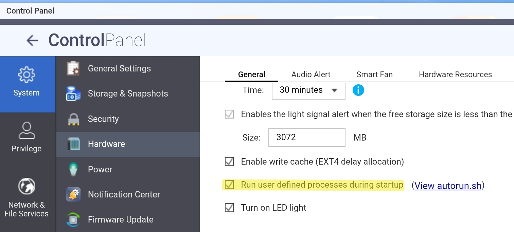

To make sudoers changes permanent on a QNAP TS-253, you must use a startup script because QTS recreates the `/usr/etc/sudoers.d` directory and the `/etc/sudoers` file from a RAM image during every boot. 

## Using `autorun.sh` (Recommended)
This is the standard way to ensure your custom sudoers configuration is reapplied after every restart.  

**Enable Autorun:**  
In the QTS web interface, go to...  
  
`Control Panel > Hardware and tick "Run user defined processes during startup".`  
  

  
**Mount the Config Partition:**  
SSH into your NAS as admin and mount the special configuration partition where `autorun.sh` resides.  
The exact command varies by model, but for Intel-based units like the TS-253, it is typically:
```
# Mount the config partition (example for many QNAP models)
mount $(/sbin/hal_app --get_boot_pd port_id=0)6 /tmp/config
```
_(Use code with caution.)_

On successfully mounting the config partition the following example shows the files likely to be present in the directory.  
In this example, the `autorun.sh` file does not exist yet.  

```
ls -al /tmp/config

drwxr-xr-x  3 admin administrators 1.0K 2026-03-06 16:05 ./
drwxrwxrwx 26 admin administrators 3.0K 2026-03-07 17:37 ../
drwx------  2 admin administrators  12K 2010-01-11 05:41 lost+found/
-rw-r--r--  1 admin administrators 8.2K 2026-03-06 16:08 smb.conf
-rw-r--r--  1 admin administrators   11 2026-03-06 16:08 smb.conf.cksum
-rw-r--r--  1 admin administrators   37 2026-03-04 15:48 system.map.key
-rw-r--r--  1 admin administrators   17 2026-03-04 15:43 .sys_update_time
-rw-r--r--  1 admin administrators 9.3K 2026-03-06 16:08 uLinux.conf
```
**Create/Edit the autorun.sh Script:**  
Create or edit the `/tmp/config/autorun.sh` file.  
The script will create the `sudoers.d` directory and injects your user sudoer user into the file.  
Replace `YourUsername` in the script with your actual or required user name.  

```
#!/bin/sh
# Re-create the sudoers.d entry file on boot
if [ ! -d /usr/etc/sudoers.d ] ; then mkdir /usr/etc/sudoers.d; fi;
echo "YourUsername ALL=(ALL) ALL" > /usr/etc/sudoers.d/YourUsername
```
_(Use code with caution.)_

**Set Permissions on autorun.sh**  
Make the script executable using the following command.  

```
chmod +x /tmp/config/autorun.sh
```

**Check directory contents**  
The `autorun.sh` file is now present and marked with an asterisk as shown in the following exampl.  
_(An asterisk indicates on QNAP that the file is executable.)_  

```
ls -al /tmp/config

drwxr-xr-x  3 admin administrators 1.0K 2026-03-06 16:05 ./
drwxrwxrwx 26 admin administrators 3.0K 2026-03-07 17:37 ../
-rwxr-xr-x  1 admin administrators  506 2026-03-06 16:05 autorun.sh*
drwx------  2 admin administrators  12K 2010-01-11 05:41 lost+found/
-rw-r--r--  1 admin administrators 8.2K 2026-03-06 16:08 smb.conf
-rw-r--r--  1 admin administrators   11 2026-03-06 16:08 smb.conf.cksum
-rw-r--r--  1 admin administrators   37 2026-03-04 15:48 system.map.key
-rw-r--r--  1 admin administrators   17 2026-03-04 15:43 .sys_update_time
-rw-r--r--  1 admin administrators 9.3K 2026-03-06 16:08 uLinux.conf
```

**Unmount the Config Partition.**  
Use the following command.  

```
umount /tmp/config
```
Finally exit your SSH session.  
Whenever the QNAP NAS is rebooted your sudoer entry will always be created.
<hr>
Reference: https://wiki.qnap.com/wiki/Running_Your_Own_Application_at_Startup
